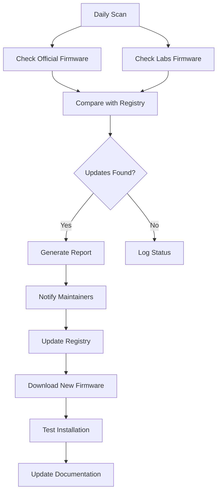

# Issue #65: Firmware Automation

**Issue Title**: Enhancement/Workflow: Automate maintenance of latest firmware packages (official & labs)  
**Status**: Open  
**Assignee**: fxstein  
**Labels**: enhancement, workflow

## Overview

Create automation and workflow for maintaining the latest available firmware packages for both official and Labs releases.

## Current State Analysis

### Existing Capabilities
- Manual firmware discovery and download
- Firmware tree structure in repository
- Basic firmware management scripts
- URL-based firmware fetching (Issue #60)

### Current Limitations
- Manual process for finding new firmware
- No automated scanning for updates
- No central tracking system
- Inconsistent firmware management

## Implementation Strategy

### Phase 1: Central Tracking System (High Priority)
**Estimated Effort**: 2-3 days

#### 1.1 Central Sheet/Wiki Implementation
```markdown
# Firmware Registry
docs/firmware/
├── registry.md              # Central firmware list
├── official-firmware.md     # Official releases
├── labs-firmware.md         # Labs releases
└── automation/
    ├── scan-firmware.zsh    # Scanning script
    └── update-registry.zsh  # Registry updater
```

#### 1.2 Registry Format
```yaml
# Firmware registry entry
HERO11_Black:
  model: "HERO11 Black"
  latest_official: "H22.01.02.32.00"
  latest_labs: "H22.01.02.32.70"
  url_official: "https://device-firmware.gopro.com/v/H22.01.02.32.00/UPDATE.zip"
  url_labs: "https://github.com/gopro/labs-firmware/releases/download/H22.01.02.32.70/UPDATE.zip"
  last_checked: "2024-01-15T10:30:00Z"
  status: "active"
```

### Phase 2: Automated Scanning (High Priority)
**Estimated Effort**: 3-4 days

#### 2.1 Scanning Script
```zsh
# Automated firmware scanner
scripts/firmware/scan-firmware.zsh
```
- Scan GoPro official firmware repository
- Check GitHub Labs releases
- Compare with local registry
- Generate update reports

#### 2.2 Scheduled Automation
```zsh
# Cron job or GitHub Actions
0 6 * * * /path/to/goprox/scripts/firmware/scan-firmware.zsh
```
- Daily automated scanning
- Email notifications for updates
- Integration with GitHub Actions

### Phase 3: Test Install Workflow (Medium Priority)
**Estimated Effort**: 2-3 days

#### 3.1 Test Installation Script
```zsh
# Test firmware installation
scripts/firmware/test-install.zsh
```
- Automated firmware installation
- Version verification from SD card
- Rollback capabilities
- Test reporting

#### 3.2 Version Retrieval
```zsh
# Extract version from SD card
scripts/firmware/extract-version.zsh
```
- Read firmware version from camera
- Parse version information
- Validate installation success

### Phase 4: Documentation and Workflow (Medium Priority)
**Estimated Effort**: 1-2 days

#### 4.1 Workflow Documentation
- Step-by-step firmware testing process
- Troubleshooting guides
- Best practices documentation

#### 4.2 Maintainer Tools
- Dashboard for firmware status
- Update notification system
- Historical tracking

## Technical Design

### Firmware Sources
**Official Firmware**:
- GoPro device firmware repository
- API endpoints for version checking
- Direct download URLs

**Labs Firmware**:
- GitHub releases repository
- Release notes and changelogs
- Download links

### Registry Structure
```json
{
  "firmware_registry": {
    "version": "1.0",
    "last_updated": "2024-01-15T10:30:00Z",
    "models": {
      "HERO11_Black": {
        "official": {
          "latest": "H22.01.02.32.00",
          "url": "https://device-firmware.gopro.com/v/H22.01.02.32.00/UPDATE.zip",
          "release_date": "2024-01-10",
          "changelog": "Bug fixes and performance improvements"
        },
        "labs": {
          "latest": "H22.01.02.32.70",
          "url": "https://github.com/gopro/labs-firmware/releases/download/H22.01.02.32.70/UPDATE.zip",
          "release_date": "2024-01-12",
          "changelog": "Experimental features and improvements"
        }
      }
    }
  }
}
```

### Automation Workflow


## Integration Points

### Existing Firmware System
- Integrate with Issue #60 (URL-based fetch)
- Extend existing firmware scripts
- Maintain backward compatibility

### GitHub Actions
- Automated daily scanning
- Release notifications
- Documentation updates

### Repository Structure
- Firmware registry in docs/
- Automation scripts in scripts/firmware/
- Test results in output/

## Success Metrics

- **Automation**: 100% automated scanning
- **Coverage**: All supported camera models
- **Reliability**: 99% accurate version detection
- **Timeliness**: Updates within 24 hours

## Dependencies

- Issue #60 (Firmware URL-based fetch) - foundation
- GitHub Actions for automation
- GoPro firmware API access
- Test hardware availability

## Risk Assessment

### Low Risk
- Based on existing firmware infrastructure
- Incremental implementation possible
- Non-breaking changes

### Medium Risk
- API rate limiting
- Test hardware requirements
- Automation reliability

### High Risk
- GoPro API changes
- Firmware compatibility issues
- Test environment setup

### Mitigation Strategies
- Robust error handling
- Fallback mechanisms
- Extensive testing
- Manual override capabilities

## Next Steps

1. **Immediate**: Set up central registry structure
2. **Week 1**: Implement automated scanning
3. **Week 2**: Create test installation workflow
4. **Week 3**: Set up GitHub Actions automation
5. **Week 4**: Documentation and validation

## Related Issues

- #60: Firmware URL-based fetch (foundation)
- #64: Exclude firmware zip files (complements automation)
- #66: Repository cleanup (organization)
- #67: Enhanced default behavior (integration) 